# Хозблок 6,0 × 2,3 м (по крыше) с наполнением для хранения

Каркасный утеплённый хозблок-«распашонка» без перегородок: вход по центру длинной стены,
слева — **мастерская** (верстак, перфопанель, стеллаж), справа — **зона садового инвентаря и техники**
(инструментальная стена, антресоль, место для газонокосилки, мотоблока и тачки).

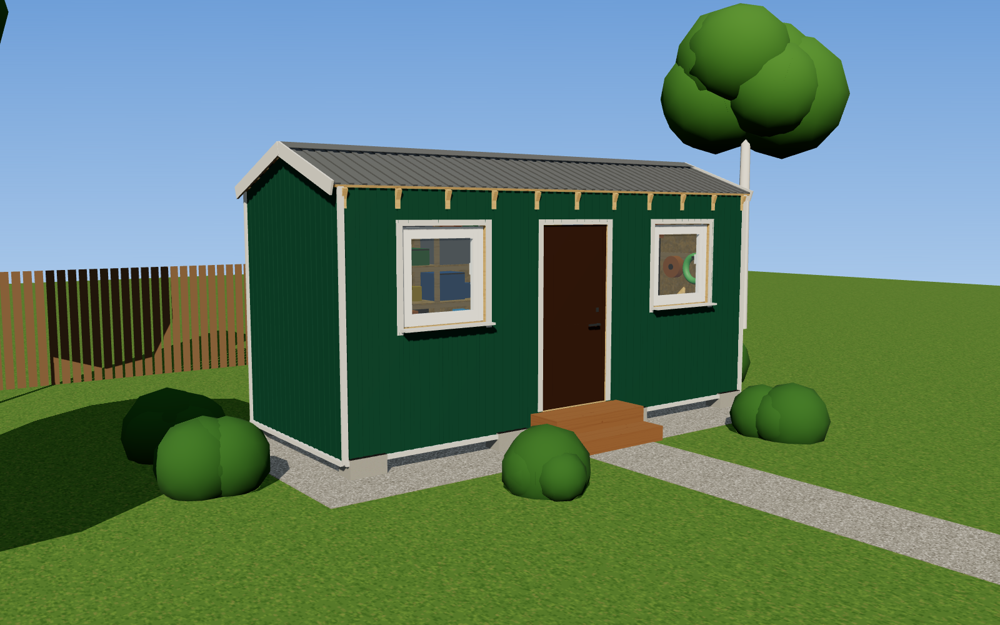

| | |
|---|---|
| 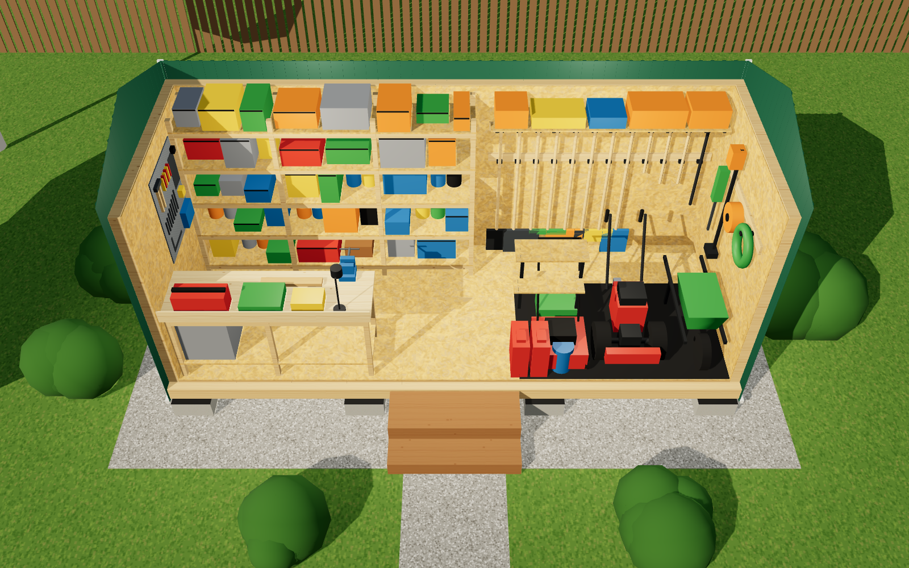 | 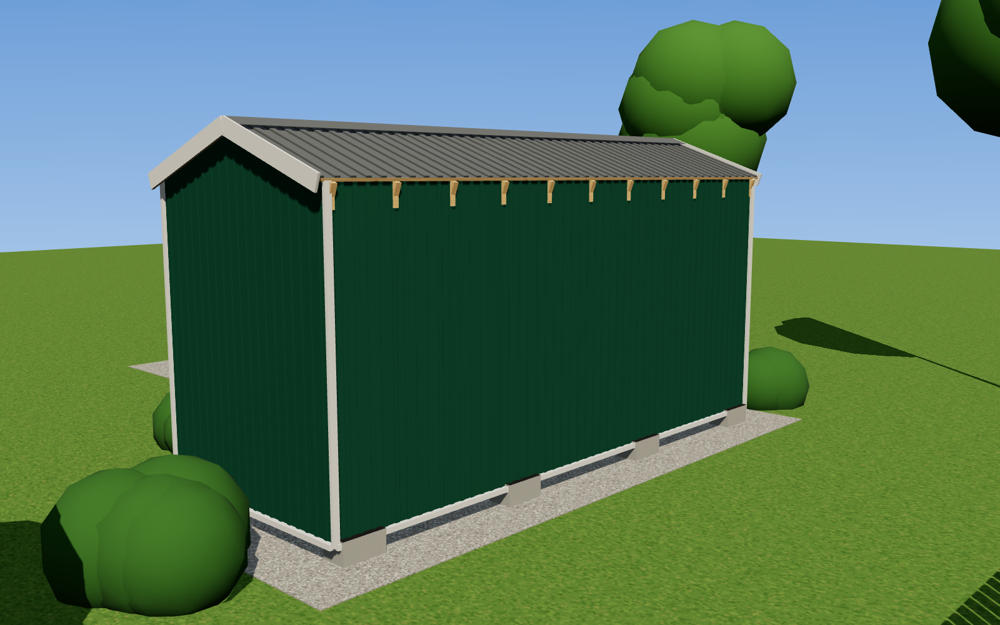 |
| 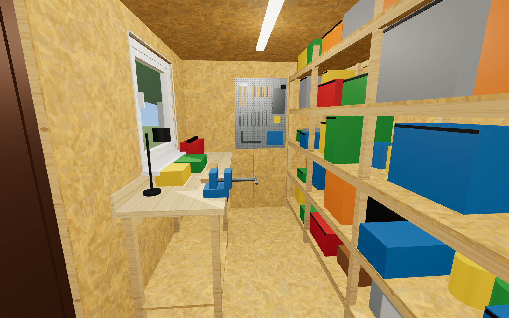 | 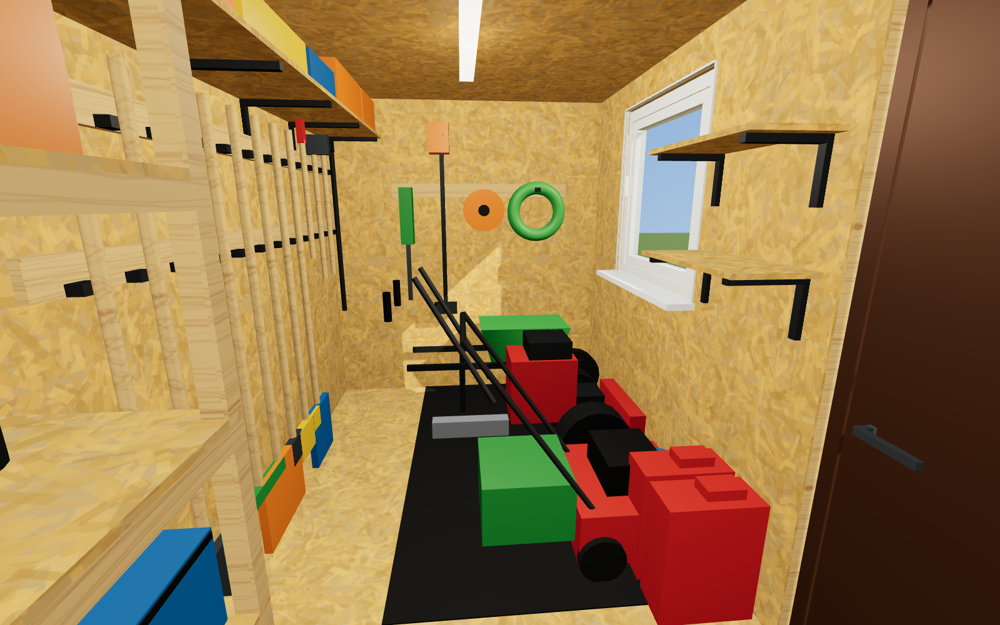 |
| 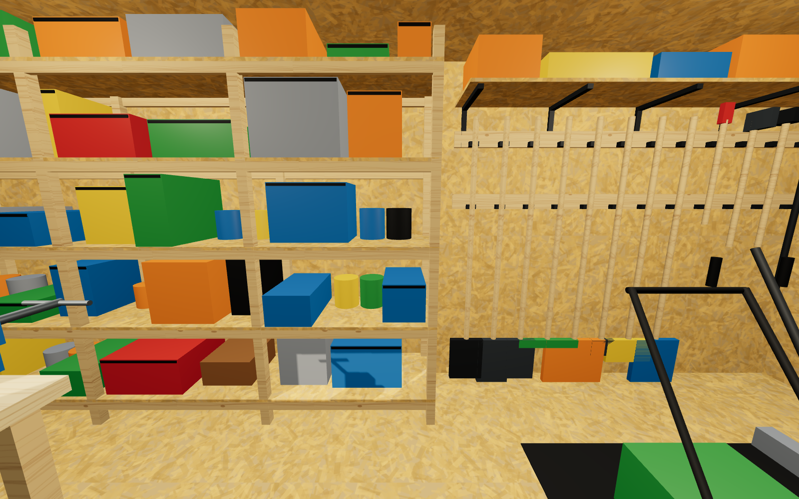 | 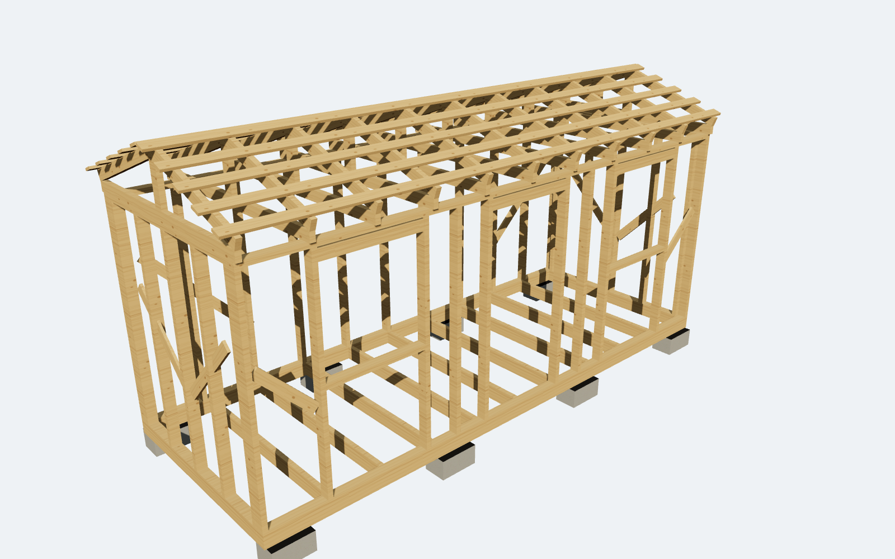 |

## Что внутри

| Файл | Что это |
|---|---|
| [`drawings/khozblok_chertezhi.pdf`](drawings/khozblok_chertezhi.pdf) | Сборочные чертежи, 6 листов А3 (PNG-копии: `drawings/list_1…6.png`) |
| [`smeta/smeta_khozblok.xlsx`](smeta/smeta_khozblok.xlsx) | Смета в Excel с формулами + лист «Опции» |
| [`smeta/smeta.md`](smeta/smeta.md) | Та же смета в текстовом виде |
| `images/*.png` | Визуализации снаружи и изнутри, варианты цвета профлиста |
| [`render/viewer.html`](render/viewer.html) | Интерактивная 3D-модель (крутить мышью, кнопки видов) |

### Листы чертежей

1. **Фасады** (М 1:50) — главный, задний, торцы, отметки, ведомость отделки и цвета.
2. **План с расстановкой оборудования** (М 1:25) с экспликацией + план фундамента на блоках.
3. **Разрез 1-1** (М 1:20) и **узлы 1, 2** (М 1:10): пирог пола, стены, потолка и кровли.
4. **Развёртки внутренних стен** (М 1:30) — где что висит и стоит, с высотами.
5. **Каркас** — раскладка стоек всех стен, каркас пола, ферма Ф-1, спецификация пиломатериала.
6. **Оборудование** — верстак, стеллаж, инструментальная стена: размеры и материалы.

## Конструкция (по ТЗ)

| Элемент | Решение |
|---|---|
| Размер | 6000 × 2300 по крыше, каркас 5800 × 2200, помещение 5582 × 1982 (≈ 11,1 м²) |
| Высота помещения | **2170 мм** в чистоте (под металлическую дверь), конёк +3,22 м от земли |
| Фундамент | 8 бетонных блоков 400×200×200 на щебёночной подушке, рубероид в 2 слоя |
| Каркас | обвязка брус 100×150, лаги 50×150, стойки 50×100 шаг ≤ 600, раскосы, 11 ферм 50×100 |
| Утепление | минвата 100 мм по кругу — пол, стены, потолок |
| Пароизоляция | Изоспан B по кругу; снаружи — ветро-влагозащита Изоспан A |
| Пол | двойной: черновой пол → утеплитель → доска 25 мм + ОСБ-3 12 мм |
| Внутри | ОСБ-3 9 мм (стены, потолок) |
| Снаружи | профлист С8 0,45 мм полимер, цвет на выбор (по умолчанию RAL 6005) + белые доборы |
| Кровля | двускатная 20°, профлист С20 оцинкованный (металлик) по обрешётке 25×100 |
| Окна | 2 шт. ПВХ 1000×1000 поворотно-откидные — над верстаком и над зоной техники |
| Дверь | металлическая 2050×960 (полотно 900), пр-во РФ, открывание наружу |
| Крыльцо | деревянные ступени: 2 подъёма + площадка 1300×450 |

### Наполнение (поз. 21–34 на плане)

- **21** Верстак 2000×650, h = 900: столешница — фанера 2×18 мм, нижняя полка, бортик.
- **22** Слесарные тиски 125 мм. **23** Тумба-кассетница на 4 ящика под верстаком.
- **24** Перфопанель 750×1000 на левом торце (ручной инструмент над верстаком).
- **25** Стеллаж 3000×500×2100 на 5 ярусов вдоль задней стены (ящики, кейсы, удобрения, краска).
- **26** Инструментальная стена: 2 рейки и 12 держателей для лопат, грабель, вил, метлы и т.п.
- **27** Антресоль 2430×400 над инструментом, h = 1900 (сезонные вещи).
- **28** Две полки у двери для ГСМ, масла и мелочей; канистры стоят под ними.
- **29** Рейка с крюками на правом торце: шланг, удлинитель, триммер, кусторез.
- **30–32** Места под газонокосилку, мотоблок/культиватор и садовую тачку у входа. **33** Резиновый коврик.
- **34** Светодиодные светильники (опция, при подключении электричества).

Проход между верстаком и стеллажом — 830 мм; от двери до зоны техники путь прямой, без порогов внутри.

## Смета (итог)

| | ₽ |
|---|---:|
| Материалы (стройка) | 202 885 |
| Наполнение (верстак, стеллажи, хранение) | 45 100 |
| Работы | 119 000 |
| Непредвиденные 5 % | 18 349 |
| **Всего** | **≈ 385 000** |

Цены ориентировочные (розница Московского региона, сентябрь 2026). Опции (электрика, пандус для техники,
покраска ОСБ, односкатная кровля, металлический стеллаж) — на листе «Опции» в Excel и в конце `smeta.md`.

## Цвет профлиста

| RAL 6005 зелёный мох | RAL 8017 шоколад | RAL 5005 синий |
|---|---|---|
|  | 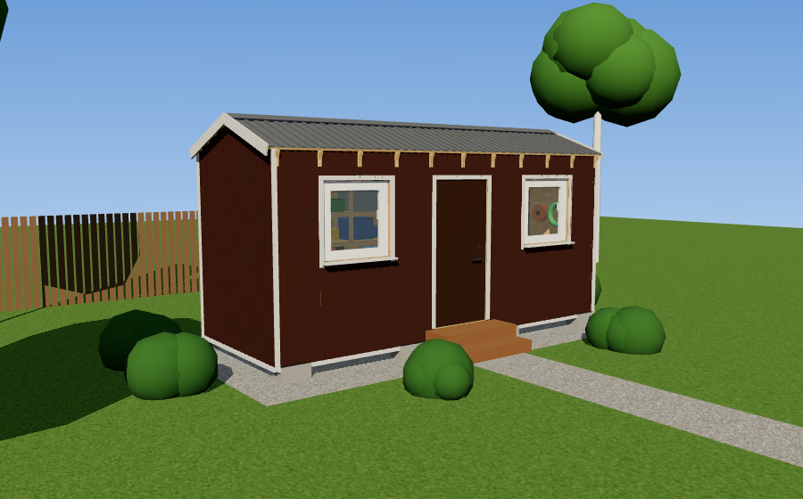 | 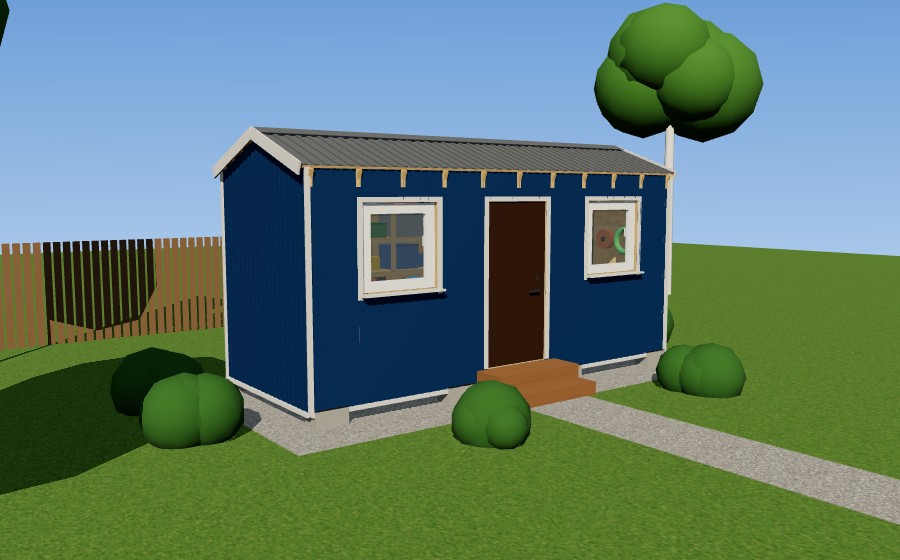 |
| **RAL 3005 вишня** | **RAL 1015 слоновая кость** | |
| 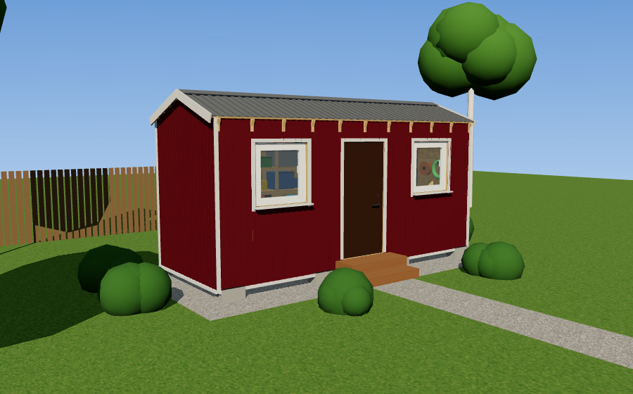 | 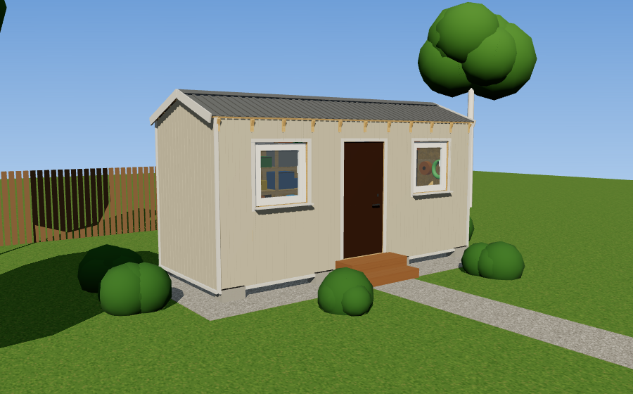 | |

## Как пересобрать

Всё генерируется из одной параметрической модели `model/build_model.py` (поменяли размер — перестроились
чертежи, 3D и смета):

```bash
python3 model/build_model.py                    # model/model.json
export THREE_DIR=/путь/к/node_modules/three     # three@0.169.0 (npm i three@0.169.0)
node render/dump.mjs                            # габариты деталей 3D -> model/parts.json
node render/render.mjs                          # images/*.png (нужен playwright + chromium)
python3 drawings/make_drawings.py               # PDF + PNG листов (matplotlib)
python3 smeta/make_smeta.py                     # xlsx + md (openpyxl)
```

Интерактивный просмотр: `python3 -m http.server` в корне репозитория и открыть
`http://localhost:8000/render/viewer.html`.

## Другие проекты в репозитории

- [`grishino-modus-9x11/`](grishino-modus-9x11/) — «Гришино-Модус 9х11»: участок с каркасным домом 9,0×11,5 по эскизу заказчика, проверка и перетрассировка всех сетей, листы в PDF/PNG и архив `Гришино-Модус_9х11.zip`.
- [`grishino-modus-9x11-sad/`](grishino-modus-9x11-sad/) — «Гришино-Модус 9х11 · терраса в сад»: отдельный проект участка, дом 9,0×11,5 развёрнут террасой в сад, вход со стороны калитки; листы, PDF и архив `Гришино-Модус_9х11_терраса_в_сад.zip`.
