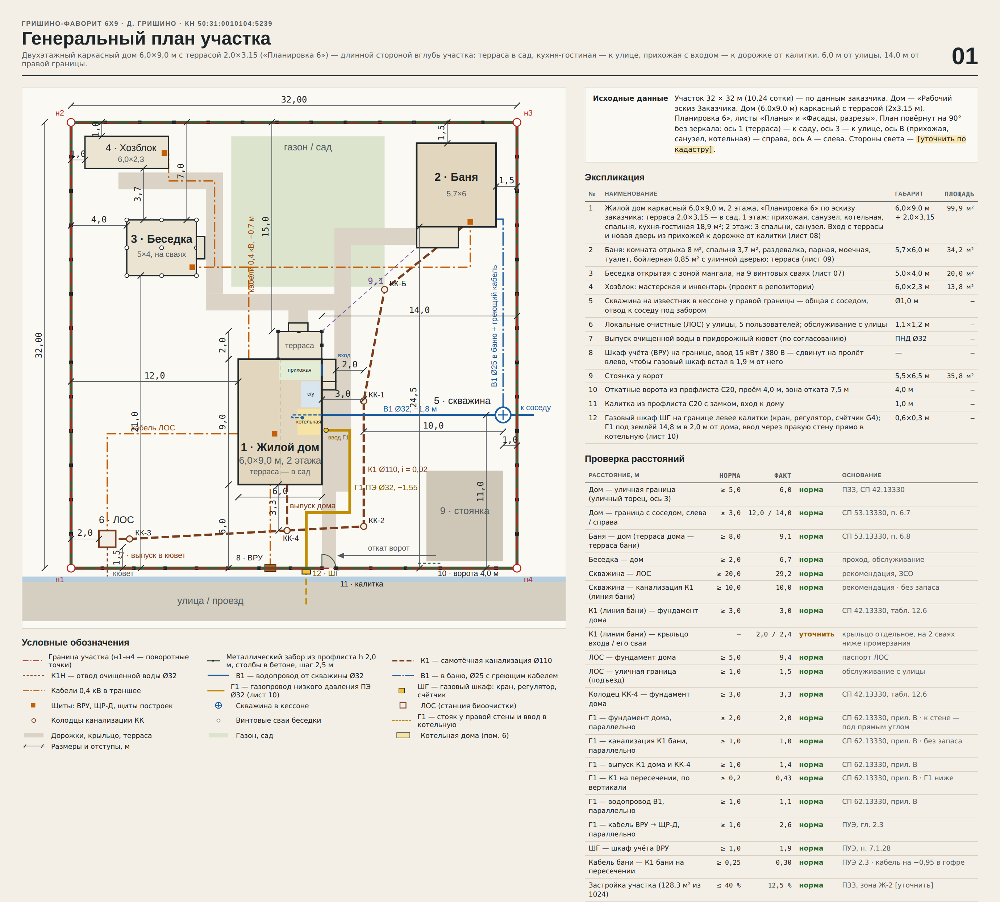

# Гришино-Фаворит 6х9

Отдельный проект участка в д. Гришино (КН 50:31:0010104:5239, 32 × 32 м) с двухэтажным каркасным домом
**6,0 × 9,0 м с террасой 2,0 × 3,15 м** по рабочему эскизу заказчика «Планировка 6»
(`iskhodnye/Эскиз_заказчика_дом_6x9_Планировка_6.pdf`): 13 помещений, 99,9 м², застройка 60,3 м².
Терраса — в сад, входная дверь — со стороны калитки. Все сети участка проверены и проложены под этот дом.

Интерактивный холст с листами: https://claude.ai/artifact/VNZ47TmcYSd7upGRrUR1Mx (приватный — открыть доступ можно
через меню Share на странице). Другие проекты участка не изменены: «Участок в Гришино — генплан» (модульный дом),
«Гришино-Модус 9х11» и «Гришино-Модус 9х11 · терраса в сад».



## Что внутри

| Путь | Что это |
|---|---|
| `Гришино-Фаворит_6х9_листы.pdf` | Все 12 листов одним PDF |
| `listy/*.png` | Листы 00–11 по отдельности |
| `canvas/project/` | Исходники листов холста (`*.dc.html` + `canvas.json`) |
| `src/` | Генератор: `calc.py` — геометрия и расчёты сетей, `plan.py` — планы 1 и 2 этажа, `*_board.py` — листы, `fence.py` — расчёт забора (лист 02), `original/` — исходный генплан |
| `iskhodnye/` | Эскиз заказчика (планы, фасады, разрезы) |

## Посадка дома

- Дом стоит длинной стороной вглубь участка: 6,0 м от улицы, 12,0 м от левой и 14,0 м от правой границы.
- План эскиза повёрнут на 90° без зеркала: терраса (ось 1) — **в сад**, к бане и беседке; уличный торец (ось 3) —
  кухня-гостиная и спальни 2 этажа; правая стена (ось В) — прихожая, санузел, котельная, к дорожке от калитки.
- Назначение помещений в эскизе не подписано — принято по окнам: 3 (окно О-2) — санузел, 6 (окно О-3) — котельная,
  10 над котельной — санузел 2 этажа, 8 — кухня-гостиная 18,9 м².

## Входная дверь со стороны калитки — проверено

| Вариант | Итог |
|---|---|
| Правая стена прихожей 2: простенок 1 353 мм, проём 860 — в 203 мм от стены оси 2 и в 290 мм от перегородки санузла, коробка ≈ 0,96 м помещается; прихожая работает тамбуром | **принят**: металлическая дверь 860, крыльцо 1,0 × 1,6 на 2 сваях под козырьком, от калитки ≈ 13 м |
| Уличный торец | вход сразу в кухню-гостиную без тамбура — не рекомендуется |
| Правая стена кухни | стена занята кухонным фронтом — не подходит |
| Только Д-1 с террасы | ≈ 21 м вокруг дома — неудобно; Д-1 остаётся вторым входом из сада |

## Сети

| Сеть | Решение |
|---|---|
| К1 | Мокрые точки у правой стены и одна над другой (котельная — санузел 2 этажа). Коллектор 8,9 м под полом вдоль правой стены, выпуск −0,85 через уличный торец в 3,5 м от левого угла (2,5 м от правого), 3,3 м до КК-4 на магистрали. Линия бани — 3,0 м от дома, 10,0 м от скважины, 2,0 м от крыльца (2,4 м от его свай). Вход в ЛОС −1,39 («Лонг», до −1,40). |
| В1 | Траншея 12,45 м от кессона к правой стене под котельной (5,0 м от уличного торца, 1,8 м от ступеней крыльца), дальше 2,15 м в грунте под домом до конца футляра, подъём в подполье под холлом и 0,75 м к ГА котельной. Стальной футляр 10,1 м под К1 бани — по 5 м от неё в обе стороны, 2,0 м из них под домом. |
| Газ | ШГ левее калитки (ось x = 16,875, по 1,125 м до столбов); Г1 ПЭ Ø32 14,8 м (4,1 + 3,1 + 5,9 + 1,7) на −1,55 (под К1 с зазором 0,43 м) в 2,0 м от дома, 1,0 м от К1 бани, 1,1 м от В1; ввод через правую стену прямо в котельную. |
| Котельная | Пом. 6 проходит без переделок: 7,7 м³ (≥ 7,5), высота 2,53 (≥ 2,5), дверь 880. Окно О-3 0,235 м² при норме 0,23 — впритык, лучше 600×600. Дымоход — в коробе через санузел 2 этажа. |
| Электрика | ЩР-Д в холле; ввод от ВРУ через уличный торец; кабели к постройкам выходят в сад между сваями (по 0,75 м); кабель бани у КК-Б — на −0,95 в гофре. ΔU ≤ 2,2 %. |

## Смета

| | ₽ |
|---|---:|
| Дом 6×9, 2 этажа, с террасой и входом от калитки (ориентир) | 6 090 000 |
| Канализация | 176 470 |
| Скважина и водопровод | 545 575 |
| Электроснабжение | 348 900 |
| Газоснабжение | 330 810 |
| Остальное без изменений (забор, ЛОС, хозблок, беседка, баня) | 3 961 348 |
| Непредвиденные 5 % | 572 655 |
| **Всего по участку** | **12 025 758** |

## Перепроверка — что исправлено

1. Футляр В1 под К1 бани должен выходить на 5 м в каждую сторону, а до стены дома только 3,0 м — В1 теперь идёт в грунте
   под домом ещё 2,15 м, подъём — за концом футляра; траншея +2,2 м, смета воды +3 275 ₽.
2. Коллектор под полом — 8,9 м, а не «≈ 8 м».
3. В1 — 1,8 м от ступеней крыльца, а не 2,4 м.
4. Гильза газа — 0,35 м от перегородки котельной с кухней-гостиной и 1,55 м от перегородки с санузлом (было «1,1 м от угла»).
5. ЩР-Д — котёл и газопровод: 2,9 м, а не 3,4.
6. Г1 — выпуск К1 дома 1,4 м, стенка КК-4 1,2 м (были в одной строке с 1,4).
7. Путь от калитки к Д-1 вокруг дома — ≈ 21 м, а не 17.
8. К1 бани — крыльцо: 2,0 м (на генплане было подписано «2,1»), до свай крыльца — 2,4 м.
9. Дверь Д-1 сдвинута на 50 мм к эскизу: проём 3 100–4 000 от оси А.
10. Лист 08 в холсте назывался «Дом каркасный 9,0×11,5» — переименован в «6,0×9,0».

## Размеры на листах

- 08 дом: оси, габариты, цепочки размеров по всем проёмам обоих этажей, терраса, ступени и крыльцо, размеры помещений на плане
  и в экспликации.
- 03 канализация: привязка выпуска (3 500 / 2 500 от углов), длины коллектора (6 400 + 1 500 + 500), таблица привязки колодцев.
- 04 вода: план трассы В1 с размерами и таблица привязок.
- 05 электрика: кабельные трассы по участкам (подполье / траншея), привязки ВРУ, ЩР-Д и магистрали.
- 10 газ: длины участков Г1, привязка ШГ и стояка, план котельной с размерами (1 600 × 1 903, окно О-3, ввод газа, дверь 880).

## Осталось решить

- Подтвердить назначение помещений 3, 6, 8, 10 и согласовать с исполнителем входную дверь в правой стене прихожей.
- Окно котельной 600×600 вместо О-3 — по ТУ Мособлгаза.
- К1 бани и Г1 лежат ровно на нормативных расстояниях — выносить геодезистом вместе с домом.
- ПЗЗ (застройка 12,5 %), цена дома — по смете исполнителя.

## Как пересобрать

```bash
cd src && ./build.sh                                  # листы и canvas.json в canvas/project
SCALE=1.5 node render.mjs ../canvas/project ../listy  # PNG (playwright + chromium); имена — Main.png и т. д.
```
