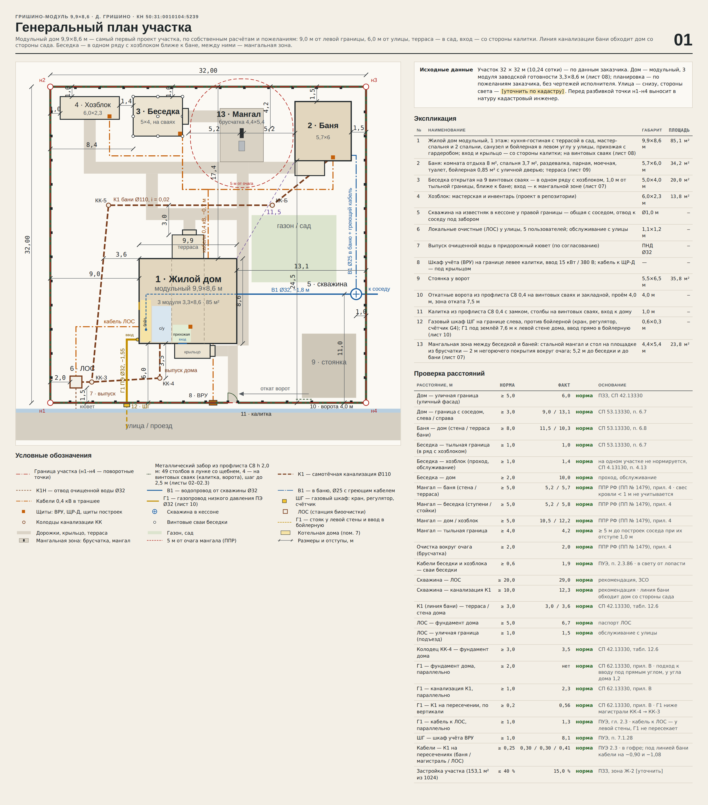

# Гришино-Модуль 9,9×8,6

Самый первый проект участка в д. Гришино (КН 50:31:0010104:5239, 32 × 32 м), который считался не по чертежам исполнителя,
а по собственным расчётам и пожеланиям заказчика: **модульный дом 9,9×8,6 м из трёх модулей 3,3×8,6** (85,1 м²),
терраса в сад, вход и крыльцо — со стороны калитки, бойлерная в левом углу у улицы.

Проект собран заново на основе листов «Участок в Гришино — генплан» (`src/original/`). В нём учтено всё, что с тех пор
решено для других вариантов участка: беседка в ряд с хозблоком и мангальная зона, забор из С8 на забивных столбах,
перепроверенные сети. Дом, баня, скважина, ЛОС, ВРУ и газовый шкаф стоят на прежних местах.

## Что внутри

| Путь | Что это |
|---|---|
| `Гришино-Модуль_9,9х8,6_листы.pdf` | Все 15 листов одним PDF |
| `listy/*.png` | Листы 00–11 по отдельности |
| `canvas/project/` | Исходники листов холста (`*.dc.html` + `canvas.json`) |
| `src/` | Генератор: `calc.py` — геометрия и все расчёты сетей, `*_board.py` — листы, `fence.py` — разбивка опор, расчёт и листы забора 02–02.3, `original/` — листы первого проекта |

Листы: 00 визуализация · 01 генплан · 02 забор · 02.1–02.3 сборочный чертёж забора · 03 канализация · 04 скважина и ЛОС · 05 электроснабжение ·
06 сводная смета · 07 беседка и мангальная зона · 08 дом модульный 9,9×8,6 · 09 баня · 10 газоснабжение · 11 проверка сетей.

Пересборка: `sh src/build.sh`, PNG — `SCALE=1.5 node src/render.mjs canvas/project listy` (нужны playwright и chromium).

## Дом

- 9,0 м от левой границы, 6,0 м от улицы; три модуля 3,3×8,6 (стыки на x = 12,3 и 15,6), на винтовых сваях с утеплённым цоколем.
- Кухня-гостиная 21,6 м² в среднем модуле, от сада до прихожей; терраса 3,2×2,4 со ступенями в сад.
- Мастер-спальня и две спальни, санузел, прихожая с гардеробом и входом со стороны калитки (крыльцо 3,6×1,5 под навесом).
- Бойлерная у левой стены в углу у улицы, с наружной дверью, окном и котлом 24 кВт (листы 08, 10).
- Цена дома — ориентир 6 511 400 ₽; её нужно заменить сметой изготовителя модулей.

## Беседка и мангальная зона

| | Решение |
|---|---|
| Ряд у тыльной границы | хозблок (x = 1,0–7,0), беседка (8,4–13,4), мангальная зона (17,2–21,6), баня (24,8–30,5) |
| Беседка 5×4 | 1,0 м до тыльной границы, как у хозблока (СП 53.13330, п. 6.7); 1,4 м до хозблока; 11,4 м до бани. Вход со ступенями — на восток, к мангалу. Мангала внутри беседки больше нет. На плане беседка — № 3, мангальная зона — № 13 |
| Мангал | очаг в 5,2 м от ступеней беседки (5,8 м от стоек), 5,2 м от стены бани, 10,5 м от дома, 12,2 м от хозблока — везде ≥ 5 м (ППР РФ, ПП № 1479, прил. 4). До тыльной границы — 4,2 м |
| Площадка | брусчатка 4,4×5,4 м на щебне — 2,0 м негорючего покрытия вокруг очага; стальной мангал 1000×400, металлический стол, огнетушитель ОП-4 и бочка с водой 200 л |
| Сети | кабели беседки и хозблока идут общей траншеей до развилки перед беседкой, в 2,0 м от свай. Ввод в беседку — по правой передней стойке, в хозблок — через переднюю стену. Под площадкой мангала сетей нет |

## Забор из профлиста С8

Листы 02 и 02.1–02.3. Смета 660 790 ₽ (5 407 ₽/м).

- **Столбы.** 49 рядовых и угловых столбов 60×60×2 длиной 3 700:
  - лунка Ø200 мотобуром на 0,8 м;
  - столб забивается до −1,500 (ниже промерзания 1,4 м);
  - лунка засыпается щебнем 20–40 с трамбовкой, подземная часть покрывается битумной мастикой;
  - без бетона.
- **Винтовые сваи** стоят только под калиткой и воротами:
  - СВС-89 — под 2 столба калитки;
  - СВС-108 — под 2 столба ворот и 2 сваи закладной.
- **Лаги и лист.** Лаги 40×20×1,5 в 2 ряда, лист С8 0,4 мм. Ворота и калитка обшиты тем же листом.
- **Ниши ВРУ и ШГ** — в двух отдельных пролётах уличного забора:
  - ШГ — в пролёте 6,6–8,9, против бойлерной;
  - ВРУ — в пролёте 15,75–18,0, левее калитки.

  Лунки и сваи не попадают на сети. Расстояния в свету:

  | Сеть | Расстояние, м |
  |---|---|
  | Выпуск ЛОС | 0,50 |
  | Кабель ВРУ | 0,65 |
  | Газ | 1,05 |
  | В1 к соседу | 1,02 |
  | Кессон | 0,56 |

## Сети — что пересчитано

| Сеть | Решение |
|---|---|
| К1 дома | выпуск −0,85 через уличную стену у санузла, 3,5 м до КК-4, магистраль КК-4 → КК-3 → ЛОС |
| К1 бани | в первом проекте линия шла между домом и скважиной в 1,6 м от дома, а там нельзя одновременно выдержать 3 м до дома и 10 м до скважины. Теперь линия обходит дом со стороны сада: КК-Б → КК-5 по y = 12,0 (3,0 м от террасы), дальше по левой стороне в КК-3. Длина 41,8 м, до скважины 12,3 м. Выпуск бани поднят до −0,50, вход в ЛОС −1,36 («Лонг», до −1,40) |
| В1 | траншея 11,55 м от кессона к правой стене и 12,8 м по утеплённому подполью до бойлерной. С канализацией не пересекается — стальной футляр больше не нужен |
| Газ | ШГ слева, Г1 ПЭ Ø32 7,6 м к левой стене (−1,55, под магистралью К1 с зазором 0,56 м), ввод прямо в бойлерную. Кабель к ЛОС Г1 не пересекает |
| Электрика | ВРУ на границе, кабель под крыльцом к ЩР-Д в прихожей; кабели к постройкам идут по подполью с выходом в сад правее террасы. Под линией бани они лежат в гофре на −0,90 и −1,08 (зазор 0,30 м). Кабельные траншеи — 59,0 м, ΔU всех линий ≤ 2,8 % |

Проверка всех расстояний — таблица на листе 01, изменения и исправленные ошибки — лист 11.

## Смета

| Раздел | ₽ |
|---|---|
| Забор С8 | 660 790 |
| Канализация | 170 280 |
| ЛОС | 224 840 |
| Скважина и водопровод | 536 900 |
| Электроснабжение | 349 530 |
| Хозблок | 385 334 |
| Беседка | 402 270 |
| Мангальная зона | 160 380 |
| Дом модульный (ориентир) | 6 511 400 |
| Баня (ориентир) | 2 311 000 |
| Газоснабжение | 326 160 |
| Непредвиденные 5 % | 601 944 |
| **Всего по участку** | **12 640 828** |

## Осталось решить

- Выносить линию К1 бани геодезистом вместе с домом и сваями террасы: она идёт ровно в 3,0 м от террасы.
- Выпуск бани −0,50 заложить в УШП бани; уклон 0,02 не завышать, иначе понадобится исполнение ЛОС «Супер Лонг».
- Бойлерная: окно, дверь, высота и проходки заказываются на заводе модулей до изготовления.
- ТУ Мособлгаза — место ШГ, давление в сети.
- Местный порядок использования открытого огня уточнить в администрации поселения.
