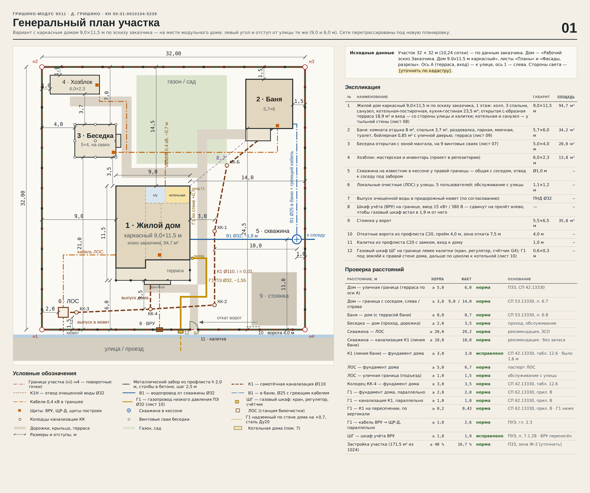

# Гришино-Модус 9х11

Отдельный проект участка в д. Гришино (КН 50:31:0010104:5239, 32 × 32 м): вместо модульного дома 9,9×8,6
на том же месте стоит **каркасный дом 9,0×11,5 м** по рабочему эскизу заказчика — развёрнут террасой в сад, с входом со стороны калитки
(`iskhodnye/Эскиз_заказчика_дом_9x11.5.pdf`). Все сети участка перепроверены и перетрассированы под новую планировку.

Интерактивный холст с листами: https://claude.ai/artifact/T5K5oXBLimYvF9wSafMV6n (приватный — открыть доступ можно
через меню Share на странице). Исходный вариант с модульным домом не изменён: «Участок в Гришино — генплан».



## Что внутри

| Путь | Что это |
|---|---|
| `Гришино-Модус_9х11_листы.pdf` | Все 12 листов одним PDF |
| `listy/*.png` | Листы 00–11 по отдельности |
| `canvas/project/` | Исходники листов холста (`*.dc.html` + `canvas.json`) |
| `src/` | Генератор: `calc.py` — геометрия и все расчёты сетей, `*_board.py` — листы, `fence.py` — расчёт забора (лист 02), `original/` — исходный генплан |
| `iskhodnye/` | Эскиз заказчика (планы, фасады, разрезы) |

Листы: 00 визуализация · 01 генплан · 02 забор · 03 канализация · 04 скважина и ЛОС · 05 электроснабжение ·
06 сводная смета · 07 беседка · 08 дом 9,0×11,5 · 09 баня · 10 газоснабжение · 11 проверка сетей.

## Посадка дома

- Левый угол и отступ от улицы — как у модульного дома: 9,0 м от левой границы, 6,0 м от улицы (уличный фасад, ось Г).
- **Дом развёрнут: терраса (ось А) — в сад**, к бане и беседке; ступени террасы выходят на садовую дорожку.
- План эскиза построен **зеркально**: спальни — слева, справа (к дорожке от калитки) — кухня-гостиная, прихожая и котельная.
  При простом повороте на 180° к калитке оказались бы спальни.
- **Вход со стороны калитки**: из кухни-гостиной у улицы выгорожена прихожая 3,5 × 1,6 м (5,6 м²) с металлической дверью 860
  в правой стене и крыльцом 1,0 × 1,6 м под козырьком; из прихожей — двери в холл и в котельную. Кухня-гостиная — 17,5 м².
  Общая площадь с террасой — 94,3 м² (в эскизе 94,7: 0,4 м² заняла перегородка прихожей), тёплый контур — 75,4 м².
  Дверь из холла на террасу сохранена.

## Сети — что изменилось

| Сеть | Решение для развёрнутого дома |
|---|---|
| К1 | Санузел и котельная у уличного фасада: коллектор 5,15 м (3 100 + 1 950), выпуск −0,85 через уличную стену в 4,2 м от левого угла дома, 3,5 м до КК-4. Линия бани — на x = 21,0: 3,0 м от дома, 10,0 м от скважины, 2,0 м от крыльца (2,4 м от его свай). Вход в ЛОС −1,39 («Лонг», до −1,40). |
| В1 | Траншея 12,45 м от кессона к правой стене (5,0 м от уличного фасада, 1,2 м от крыльца), дальше в грунте под домом 6,3 м до подъёма в котельной у ГА. Стальной футляр 10,1 м под К1 бани — по 5 м от неё в обе стороны, 2,0 м из них под домом. |
| Газ | ШГ левее калитки (ось x = 16,875, по 1,125 м до столбов) — прямо против котельной: Г1 ПЭ Ø32 по прямой 5,8 м (−1,55, под К1 с зазором 0,43 м), стояк на уличном фасаде 1,0 м от окна котельной, ввод прямо в котельную. |
| Электрика | ВРУ в пролёте 13,5–15,75 (1,9 м до ШГ), ввод через уличную стену, ЩР-Д в прихожей; кабели к постройкам — по подполью и под террасой в сад; кабель ЛОС — с левой стороны дома. ΔU всех линий ≤ 2,5 %. |

## Ошибки прежних вариантов — исправлены

1. Линия К1 бани шла в 1,6 м от фундамента дома (норма 3,0 м).
2. Кабель к ЛОС пересекал выпуск К1 с зазором ≈ 0,07 м (ПУЭ: ≥ 0,25 м в трубе).
3. Кабель бани пересекал К1 бани у КК-Б с зазором ≈ 0,05 м — теперь заглублён до −0,95 в гофре (0,30 м).
4. Длины кабелей в таблице линий не сходились с трассами генплана.
5. Футляр В1 под К1 был в тексте, но не в смете.
6. Траншея К1 в смете «до 1,1 м» при лотке у ЛОС −1,38.
7. Расстояние скважина — ЛОС: 29,8 м, а не 29,0 м.
8. Длина кабельных траншей была занижена на 5,7 м (не учтена ветка к беседке и хозблоку): 60 м вместо 54, смета электроснабжения +3 600 ₽.
9. Футляр В1 под К1 бани должен выходить на 5 м в каждую сторону, а до стены дома только 3,0 м — В1 теперь идёт в грунте под домом
   (6,3 м), футляр заходит под дом на 2,0 м, подъём — в котельной; траншея +6,3 м, смета воды +8 875 ₽.
10. Сумма площадей дома — 94,3 м², а не 94,7 (перегородка прихожей).
11. ЩР-Д — газопровод: 4,0 м, а не 4,2 (4,2 — до котла).
12. ШГ стоит в 0,7 м от столбов в свету (1,0 м — это Г1 до фундаментов столбов).
13. К1 бани — крыльцо: 2,0 м до края крыльца, до его свай — 2,4 м.
14. На листах не хватало размеров — добавлены (см. ниже).

## Размеры на листах

- 08 дом: оси, габариты, цепочки размеров по всем проёмам наружных стен, стойки террасы, крыльцо и ступени, размеры помещений
  в экспликации (в свету, мм).
- 03 канализация: привязка выпуска (4 200 / 4 800 от углов), длины коллектора, таблица привязки колодцев (x от левой границы,
  расстояние до уличного забора, глубина лотка, расстояния до дома и скважины).
- 04 вода: план трассы В1 с размерами (скважина, траншея 12,45 м, футляр, ввод, участок под домом, ветка в баню) и таблица привязок.
- 05 электрика: кабельные трассы по участкам (подполье / под террасой / траншея), привязки ВРУ, ЩР-Д и магистрали.
- 10 газ: длина Г1, привязка ШГ и стояка, план котельной с размерами (2 800 × 1 900, окно, ввод газа), проход к котлу.

## Осталось решить

- Согласовать с исполнителем зеркальный план и прихожую 5,6 м², выгороженную из кухни-гостиной.
- Подтвердить назначение помещений 6, 7, 8 (в эскизе все подписаны «Комната»).
- Котельная: в эскизе нет окна, дверь 660 мм, потолок до 2,3 м. Для газового котла нужны окно 0,6×0,8, дверь ≥ 0,8 и высота ≥ 2,5 м —
  передать исполнителю (лист 10).
- Линию К1 бани выносить геодезистом: запаса нет ни до дома (3,0), ни до скважины (10,0).
- ТУ Мособлгаза, ПЗЗ (процент застройки 16,7 %), цена дома — по смете исполнителя.

## Смета

| | ₽ |
|---|---:|
| Дом каркасный 9,0×11,5, развёрнут, с прихожей и крыльцом (ориентир) | 5 528 600 |
| Канализация | 166 860 |
| Скважина и водопровод | 552 375 |
| Электроснабжение | 347 310 |
| Газоснабжение | 325 370 |
| Остальное без изменений (забор, ЛОС, хозблок, беседка, баня) | 3 961 348 |
| Непредвиденные 5 % | 544 093 |
| **Всего по участку** | **11 425 956** (было 12 444 556 с модульным домом) |

## Как пересобрать

```bash
cd src && ./build.sh                                  # листы и canvas.json в canvas/project
SCALE=1.5 node render.mjs ../canvas/project ../listy  # PNG (playwright + chromium); имена — Main.png и т. д.
```
